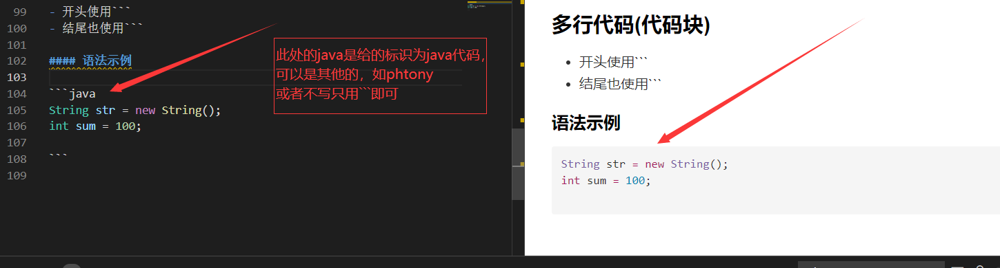

# 常用语法

[toc]

## 标题

- `#`的多少表示多少级 `# 标题`

#### 语法示例

  ```md
  # 标题
  ## 标题
  ### 标题
  #### 标题
  ##### 标题
  ###### 标题
  ```

## 字体

*斜体*
**加粗**
***斜体加粗***
$\color{red}{红颜色}$
<font color="#4590a3" size="6px">文字</font>

### 语法示例

```
*斜体*
**加粗**
***斜体加粗***
$\color{red}{红颜色}$
<font color="#4590a3" size="6px">文字</font>
```

## 列表

### 有序列表

- 使用`1. xxx`，`2. xxx`表示依次类推

 1. 第一列
 2. 第二列
 3. 第三列
 4. 第四列

#### 语法示例

  ```md
  1. 第一列
  2. 第二列
  3. 第三列
  4. 第四列
  ```

### 无序列表

**使用`- xxx`，`* xxx`，`+ xxx`表示**

- 是

- 点

- 我

- 打

#### 语法示例

- $\color{red}{注意}$使用`-` `*` `+`效果都是无序列表

  ```md

  - 是
  - 点
  - 我
  - 打
   ```

## 使用代码框

### 行内代码

- 使用行内代码，java中**String**类有个`toString()`方法输出字符串

#### 语法示例

- 下列中使用``

   ```md
   使用行内代码，java中**String**类有个`toString()`方法输出字符串.
   使用``放在两头如`toString()`和`String str = new String();` 
   ```

### 多行代码(代码块)

- 开头使用```
- 结尾也使用```

#### 语法示例

- 右边是语法，左边是效果

- 也可以看下方

```java
String str = new String();
int sum = 100; 

```
